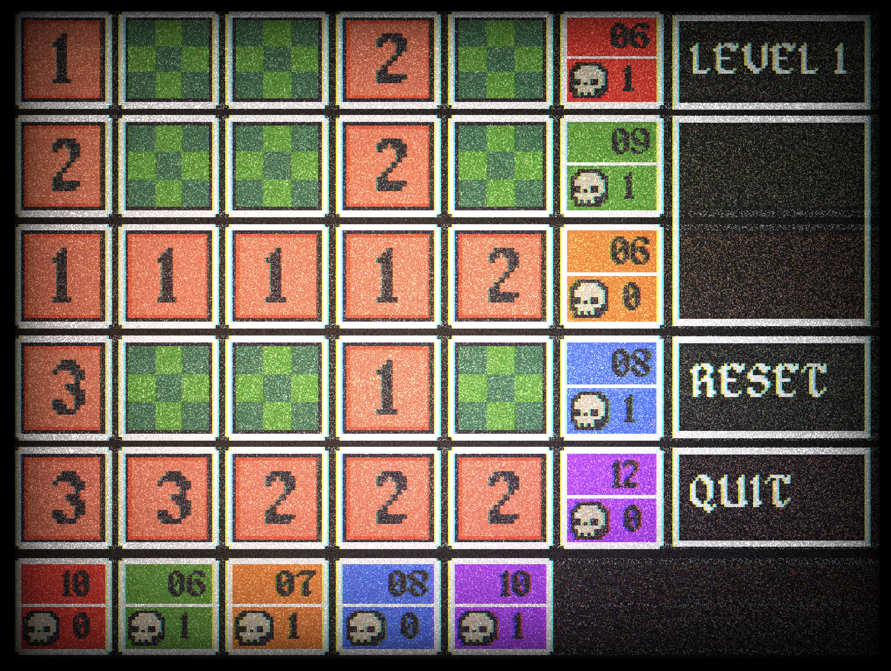

# Skull-Flip

[Click here to play](https://dmellogu.github.io/skull-flip/) 
A Phaser3 game inspired by Voltorb Flip (WIP).

## About

Skull-Flip is my recreation of Voltorb Flip, a minigame in the Korean and Western releases of Pokémon HeartGold and SoulSilver. This game is a cross between Picross and Minesweeper. It features a five-by-five grid of tiles, underneath of which are hidden numbers (1 through 3), and skulls. The goal of the game is to flip all the "2" and "3" tiles to continue on to the next level. If you flip a skull, you lose and return to level 1.

## Credits

* Alagard font: https://opengameart.org/content/pixel-fonts-by-pix3m
* Project template: https://github.com/photonstorm/phaser3-typescript-project-template
* npm run deploy command: https://github.com/yandeu/phaser-project-template/pull/10#issue-1306684978